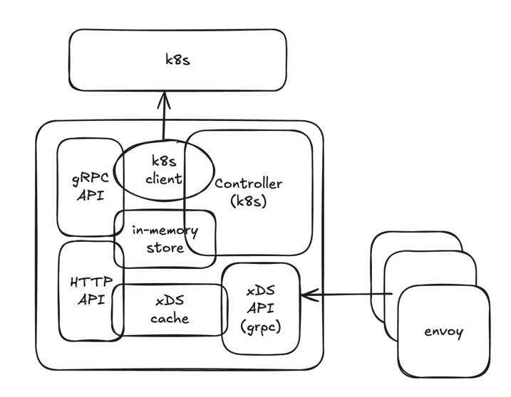

# Architecture: Envoy XDS Controller

## Overview

`envoy-xds-controller` is built as a modular, extensible Kubernetes controller that embeds a full-featured xDS (v3) server. It observes the Kubernetes API and propagates changes to Envoy proxies through the xDS protocol in real time.

## High-Level Architecture Diagram

